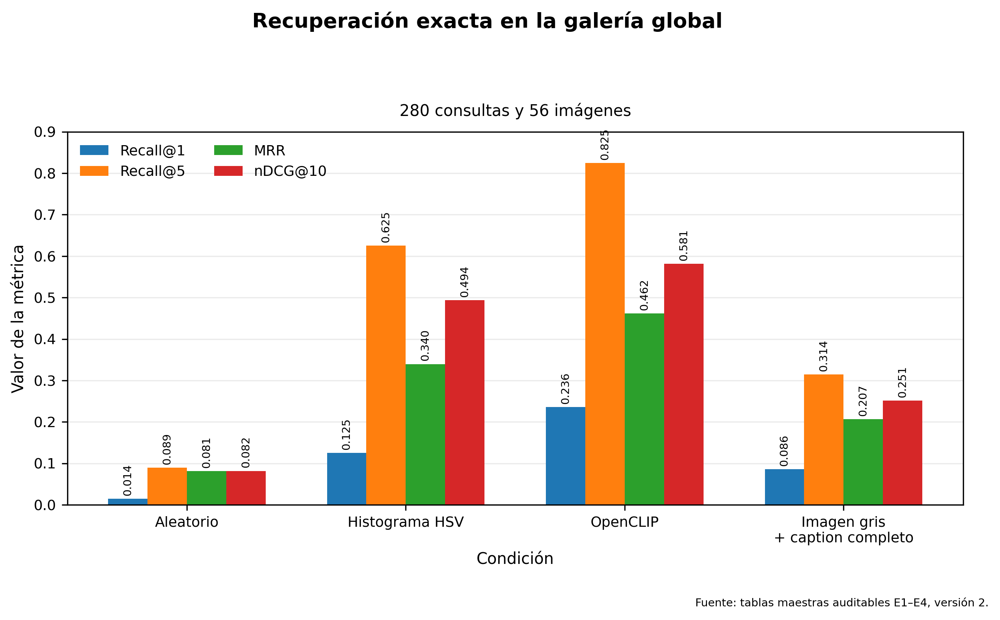

# Evaluación multimodal de patrones textiles generados

Benchmark académico reproducible para evaluar recuperación **de texto a imagen** sobre patrones geométricos sintéticos inspirados en una estética textil.

> El proyecto no identifica textiles reales, no autentica procedencia y no permite inferir cultura, periodo, técnica ni significado.

## 1. Objetivo

Evaluar si OpenCLIP puede relacionar descripciones textuales controladas con imágenes sintéticas que varían en patrón, composición, orientación y paleta.

La evidencia principal corresponde al benchmark **v2**. La evaluación cualitativa del protocolo inicial v1 se conserva únicamente como evidencia histórica claramente delimitada en el informe final.

## 2. Tarea multimodal

| Elemento | Configuración |
| --- | --- |
| Dirección principal | Texto a imagen |
| Consulta | Caption positivo |
| Galería | 56 imágenes sintéticas |
| Consultas positivas | 280 |
| Modelo | OpenCLIP ViT-B-32 |
| Pesos | `laion2b_s34b_b79k` |
| Régimen | Zero-shot, modelo congelado |
| Similitud | Coseno sobre embeddings normalizados L2 |
| Dimensión | 512 |

## 3. Dataset v2

La galería contiene 56 combinaciones visuales únicas:

| Partición sintética | Imágenes |
| --- | ---: |
| ID | 30 |
| OOD por paleta | 12 |
| OOD por patrón | 10 |
| OOD por patrón y paleta | 4 |
| **Total** | **56** |

Cada imagen posee cinco captions positivos. También se definieron cuatro negativos difíciles por unidad y 40 grupos estructurales sin color.

Documentación:

- `docs/especificacion_experimental_v2.md`
- `docs/auditoria_visual_patrones_v2.md`
- `docs/diseno_captions_positivos_v2.md`
- `docs/diseno_negativos_dificiles_v2.md`

## 4. Experimentos

| Experimento | Evaluación |
| --- | --- |
| E1 | Recuperación exacta global con OpenCLIP |
| E2 | Discriminación ante negativos difíciles |
| E3 | Comparación con baseline aleatorio y baseline HSV |
| E4 | Ablaciones cromáticas exactas y estructurales |

Familias de comparabilidad:

- `global_exact_retrieval`
- `hard_negative_forced_choice`
- `structural_multi_relevance`

No deben compararse como si midieran exactamente la misma tarea.

## 5. Resultados principales

### Recuperación exacta global

| Método | R@1 | R@5 | MRR | nDCG@10 |
| --- | ---: | ---: | ---: | ---: |
| Aleatorio | 0.014 | 0.089 | 0.081 | 0.082 |
| Histograma HSV | 0.125 | 0.625 | 0.340 | 0.494 |
| OpenCLIP | **0.236** | **0.825** | **0.462** | **0.581** |

OpenCLIP supera al baseline aleatorio y al baseline basado únicamente en color. El resultado indica alineamiento multimodal útil dentro del benchmark, pero no reconocimiento cultural.



### Negativos difíciles

| Métrica | Resultado |
| --- | ---: |
| Exactitud | 0.518 |
| MRR | 0.729 |
| nDCG@10 | 0.799 |
| Tasa de victorias pareadas | 0.835 |

La exactitud mide si el positivo queda primero frente a cuatro negativos simultáneos. La tasa pareada mide cuántas comparaciones individuales favorecen al positivo.

### Ablaciones cromáticas

La escala de grises reduce el R@1 exacto de **0.236** a **0.086**. El color aporta información importante para identificar la imagen exacta.

En la tarea estructural, la condición imagen gris + caption sin color alcanza Hit@1 = **0.425**. Esto no significa que sea universalmente superior: las tareas exacta y estructural responden preguntas diferentes.

Figuras:

- [F1: Recuperación exacta](results/v2/figuras/f1_recuperacion_exacta_v2.png)
- [F2: Negativos difíciles](results/v2/figuras/f2_negativos_dificiles_v2.png)
- [F3: Ablaciones estructurales](results/v2/figuras/f3_ablaciones_estructurales_v2.png)
- [F4: Efecto de escala de grises](results/v2/figuras/f4_efecto_grises_exacto_v2.png)
- [F5: Compromiso entre Hit@1 y Hit@5](results/v2/figuras/f5_compromiso_hit1_hit5_v2.png)

## 6. Informe final

- [`reporte_evaluacion_responsable.md`](reporte_evaluacion_responsable.md)

Incluye metodología, evolución de la versión v1 a la versión v2, resultados, casos cualitativos heredados, confiabilidad, explicabilidad, uso responsable y trazabilidad.

## 7. Tablas maestras

```text
results/v2/tablas_maestras/
├── catalogo_experimentos_v2.csv
├── metricas_maestras_v2.csv
├── comparaciones_maestras_v2.csv
└── resumen_tablas_maestras_v2.json
```

Estas tablas separan las tres familias de comparabilidad y evitan mezclar protocolos.

## 8. Estructura principal

```text
.
├── config/
├── data/
├── docs/
├── figures/                  # artefactos históricos v1
├── notebooks/
├── results/
│   └── v2/
│       ├── evaluacion/
│       ├── figuras/
│       └── tablas_maestras/
├── scripts/
├── tests/
├── README.md
└── reporte_evaluacion_responsable.md
```

## 9. Entorno reproducible

```text
Python:      3.11.9
PyTorch:     2.13.0+cpu
Torchvision: 0.28.0+cpu
OpenCLIP:    3.3.0
```

Documentación:

- `docs/entorno_reproducible_v2.md`
- `results/v2/entorno_cpu_pip_freeze.txt`

## 10. Validación

```powershell
python scripts/validar_config_informe_final_v2.py
python scripts/validar_tablas_maestras_v2.py
python scripts/validar_figuras_v2.py
python scripts/validar_informe_final_v2.py
```

Las validaciones comprueban conteos, esquemas, anclas, hashes, codificación, idempotencia y protección de artefactos históricos.

## 11. Evidencia cualitativa heredada

El protocolo v1 produjo cinco casos cualitativos, diez registros de confiabilidad, dos casos de explicabilidad y una ficha de uso responsable. Se conservan bajo `results/` y `figures/`, pero no son resultados cuantitativos de v2.

Estos artefactos siguen disponibles bajo `results/` y `figures/`, pero no se presentan como resultados cuantitativos de v2.

## 12. Limitaciones

- El dataset está formado por imágenes generadas.
- Las particiones ID/OOD son controles sintéticos.
- Los captions utilizan vocabulario controlado.
- No se demostró generalización a textiles reales.
- No se realizaron pruebas de significancia para todas las comparaciones.
- El modelo no autentica origen, técnica, periodo o cultura.

## 13. Uso responsable

Uso recomendado: docencia, retrieval multimodal, análisis de baselines y prototipos académicos con supervisión humana.

Uso no recomendado: autenticación, atribución cultural o histórica, clasificación patrimonial e interpretación automática de significados.

## 14. Estado del proyecto

| Componente | Estado |
| --- | --- |
| Dataset v2 | Completo y auditado |
| Captions | Completos |
| Negativos difíciles | Completos |
| Embeddings | Congelados |
| E1 a E4 | Evaluados |
| Tablas maestras | Validadas |
| Figuras F1 a F5 | Validadas |
| Informe final v2 | Validado |
| README v2 | Generado desde artefactos auditados |

## 15. Alcance de las conclusiones

La evidencia permite afirmar que OpenCLIP supera los baselines implementados dentro del benchmark sintético y utiliza información más allá del color.

No permite afirmar comprensión cultural, reconocimiento de textiles reales o generalización a colecciones patrimoniales.

## 16. Repositorio

Rama de desarrollo y entrega:

```text
henry/examen-final-mcc225
```

Los resultados oficiales están en `results/v2/` y el informe canónico es `reporte_evaluacion_responsable.md`.
