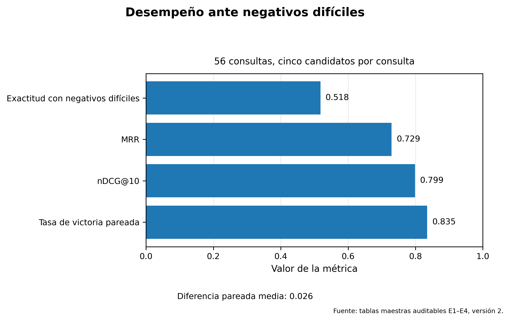
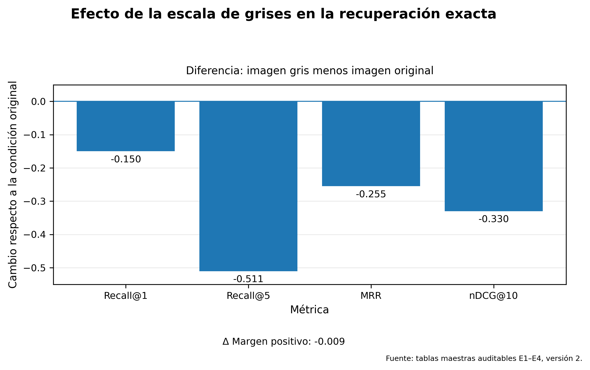
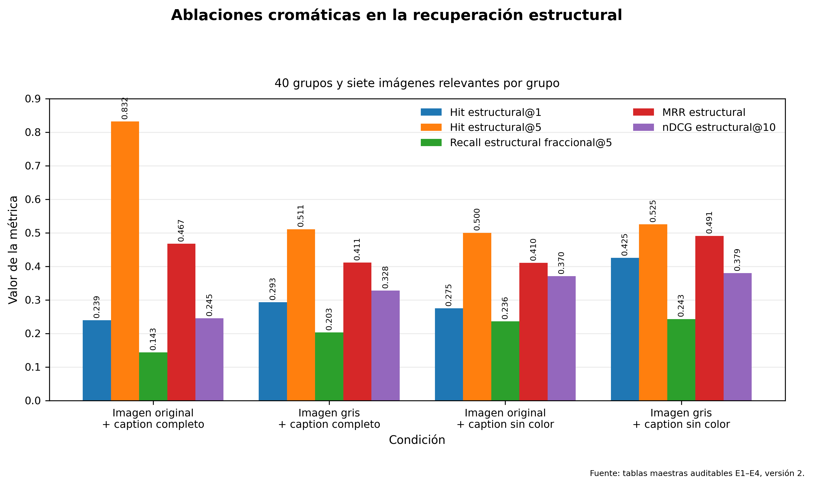
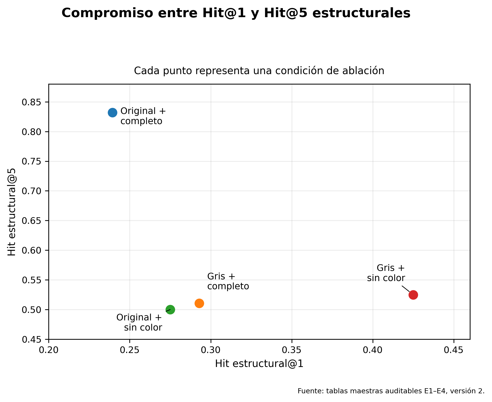
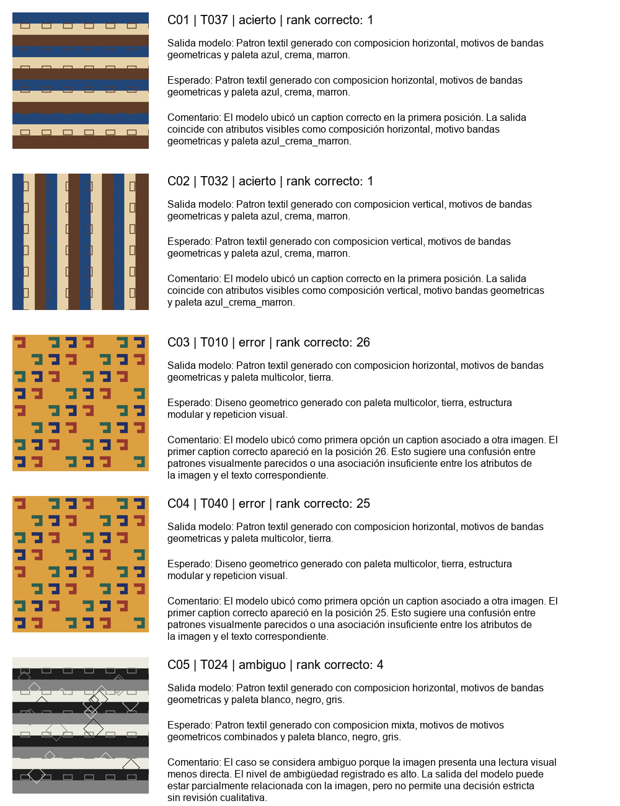
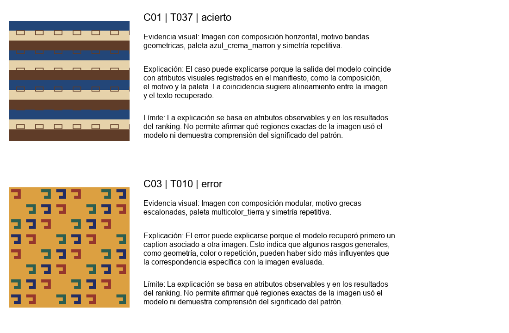

# Evaluación responsable de recuperación de texto a imagen sobre patrones textiles generados

> **Versión final v2.** La evidencia cuantitativa principal procede del benchmark v2. Las secciones cualitativas heredadas del protocolo v1 se mantienen como evidencia histórica y están identificadas explícitamente; no deben interpretarse como resultados cuantitativos de v2.

## 1. Proyecto personal y alcance

Este trabajo evalúa un prototipo multimodal para relacionar descripciones textuales controladas con imágenes sintéticas de patrones geométricos inspirados en una estética textil. La tarea principal de v2 es **recuperación de texto a imagen**: cada consulta textual debe ordenar una galería de 56 imágenes y situar la imagen correspondiente en una posición alta.

El objetivo no es construir un sistema de identificación cultural ni demostrar reconocimiento de textiles reales. El propósito es medir, en un entorno controlado, hasta qué punto OpenCLIP conserva una señal conjunta de composición, patrón y paleta, y dónde aparecen sus principales errores.

| Elemento | Definición |
| --- | --- |
| Modalidades | Texto e imagen |
| Tarea principal | Recuperación de texto a imagen |
| Modelo | OpenCLIP ViT-B-32 |
| Pesos | `laion2b_s34b_b79k` |
| Régimen | Zero-shot, modelo congelado |
| Galería | 56 imágenes sintéticas |
| Consultas positivas | 280 usos de captions, cinco por imagen |
| Usuario previsto | Estudiante, investigador o evaluador académico |
| Riesgo principal | Confundir similitud visual con identificación real o interpretación cultural |

La parte que puede evaluarse con evidencia es el **alineamiento multimodal dentro del benchmark construido**. La evaluación permite comparar rankings, líneas base, negativos difíciles y ablaciones; no permite atribuir origen, técnica, periodo, autenticidad o significado cultural.

## 2. Evolución del prototipo y adaptación experimental

La primera versión del proyecto adaptó el Cuaderno 14 para una tarea de imagen a texto sobre 40 imágenes y 200 descripciones. Esa etapa permitió comprobar el flujo general, producir cinco casos cualitativos, ejecutar pruebas breves de confiabilidad y documentar riesgos de uso.

La auditoría posterior encontró duplicación exacta y repetición semántica en v1. Por ello se diseñó v2 como un benchmark separado, con combinaciones visuales únicas, protocolo formal y artefactos verificables.

| Aspecto | Protocolo inicial v1 | Benchmark v2 |
| --- | --- | --- |
| Función principal | Adaptación académica inicial | Evaluación cuantitativa controlada |
| Dirección principal | Imagen a texto | Texto a imagen |
| Imágenes | 40 | 56 |
| Consultas | 200 descripciones candidatas | 280 usos de captions positivos |
| Baselines | Aleatorio | Aleatorio y color HSV |
| Controles | Casos y pruebas breves | Negativos difíciles, ablaciones y particiones sintéticas |
| Estado en este informe | Evidencia cualitativa heredada | Evidencia cuantitativa principal |

La adaptación más importante consistió en pasar de una demostración funcional a una evaluación con contratos explícitos. El dataset, los captions, los negativos, los embeddings, las métricas, las tablas y las figuras se validaron mediante scripts independientes e idempotencia.

El cuaderno heredado permanece como evidencia de v1. Los resultados oficiales de v2 proceden de los artefactos de `results/v2/` y no requieren regenerar los embeddings del modelo.

## 3. Construcción del dataset sintético v2

El dataset v2 contiene 56 imágenes sintéticas distribuidas en cuatro grupos controlados:

| Partición sintética | Imágenes |
| --- | ---: |
| ID | 30 |
| OOD por paleta | 12 |
| OOD por patrón | 10 |
| OOD por patrón y paleta | 4 |
| **Total** | **56** |

Cada imagen posee cinco captions positivos, lo que produce 280 usos de consulta en la recuperación exacta global. Los textos describen atributos observables y controlados: patrón, organización visual, orientación y paleta.

Para la evaluación estructural se agruparon descripciones que comparten estructura, aunque difieran en color. Se definieron 40 grupos de captions sin color, cada uno asociado a siete imágenes estructuralmente relevantes.

También se construyó una evaluación de negativos difíciles. Cada unidad contiene un caption positivo y cuatro alternativas contrafactuales controladas. Los negativos alteran u omiten atributos de forma sistemática, evitando que la evaluación se limite a distinguir textos completamente ajenos.

Las imágenes son generadas. No representan piezas documentadas, no constituyen un corpus etnográfico y no pueden usarse para autenticar ni clasificar patrimonio.

## 4. Modelo, líneas base y reproducibilidad

El modelo evaluado es OpenCLIP ViT-B-32 con pesos `laion2b_s34b_b79k`. Se utilizó sin ajuste fino. Las imágenes y textos se transformaron en embeddings de 512 dimensiones, normalizados con norma L2, y se ordenaron mediante similitud coseno.

El entorno canónico utilizó Python 3.11.9, PyTorch CPU, OpenCLIP 3.3.0 y caché externa de Hugging Face. La GPU disponible no fue necesaria para reproducir las evaluaciones a partir de los embeddings congelados.

Se compararon tres familias de métodos:

1. **Baseline aleatorio:** ordenamiento reproducible sin información visual o textual.
2. **Baseline HSV:** comparación basada en distribución de color.
3. **OpenCLIP:** representación conjunta de visión y lenguaje.

Las métricas exactas son R@1, R@5, MRR y nDCG@10. R@1 comprueba si la imagen exacta queda primera; R@5 revisa si aparece en las cinco primeras posiciones; MRR considera la posición recíproca de la primera respuesta correcta; y nDCG@10 resume la calidad del ordenamiento temprano.

En la recuperación estructural existen siete imágenes relevantes por consulta. Por ello se distinguen Hit@K y Recall fraccional@5. Hit@K indica si aparece al menos un relevante; el recall fraccional mide qué proporción de los siete relevantes entra en los cinco primeros resultados. Estas métricas no son intercambiables con la recuperación exacta.

## 5. Resultados cuantitativos v2

La tabla siguiente resume la recuperación exacta en la galería global.

| Método | R@1 | R@5 | MRR | nDCG@10 |
| --- | ---: | ---: | ---: | ---: |
| Aleatorio | 0.014 | 0.089 | 0.081 | 0.082 |
| Histograma HSV | 0.125 | 0.625 | 0.340 | 0.494 |
| OpenCLIP | 0.236 | 0.825 | 0.462 | 0.581 |
| OpenCLIP con imágenes grises | 0.086 | 0.314 | 0.207 | 0.251 |

*Figura F1. Comparación de OpenCLIP con las líneas base y con la ablación visual en escala de grises.*

OpenCLIP obtuvo R@1 = **0.236**, R@5 = **0.825**, MRR = **0.462** y nDCG@10 = **0.581**. El modelo situó la imagen exacta en primer lugar en 23.6 % de las consultas y dentro del top 5 en 82.5 %.

El resultado supera tanto al baseline aleatorio como al histograma HSV. En R@1, OpenCLIP alcanzó 0.236, frente a 0.125 del baseline de color y 0.014 del aleatorio. Esto demuestra que la recuperación no depende únicamente de azar o paleta.

Sin embargo, el desempeño sigue siendo parcial. Aproximadamente tres de cada cuatro consultas no colocan la imagen exacta en la primera posición. R@5 es alto, pero no debe interpretarse aisladamente: una imagen puede aparecer dentro de cinco resultados sin quedar correctamente priorizada.

MRR y nDCG@10 complementan esta lectura. Ambos muestran que OpenCLIP ordena la galería mejor que las líneas base, pero dejan margen para mejorar la discriminación fina entre imágenes que comparten estructura o color.

## 6. Negativos difíciles, ablaciones y generalización

### 6.1. Negativos difíciles

La evaluación E2 restringe cada decisión a un caption positivo y cuatro negativos contrafactuales.

| Métrica | Resultado | Lectura |
| --- | ---: | --- |
| Exactitud ante negativos difíciles | 0.518 | El caption positivo queda primero en 51.8 % de las unidades evaluadas. |
| MRR | 0.729 | El positivo suele aparecer en posiciones altas dentro de las cinco alternativas. |
| nDCG@10 | 0.799 | Resume la calidad del ordenamiento local. |
| Victorias pareadas | 0.835 | El positivo supera individualmente a un negativo controlado en 83.5 % de las comparaciones. |
| Diferencia pareada media | 0.026 | La diferencia media de similitud es positiva, aunque de magnitud pequeña. |

*Figura F2. Desempeño de OpenCLIP ante cuatro negativos controlados por unidad.*

La exactitud de 0.518 indica que el positivo queda primero en algo más de la mitad de los casos. Aun así, la tasa pareada de 0.835 muestra que el positivo suele superar individualmente a cada negativo. La diferencia entre ambas métricas es importante: ganar varias comparaciones pareadas no garantiza ocupar la primera posición frente a las cuatro alternativas simultáneamente.

Estos resultados describen discriminación local dentro de un conjunto diseñado. No equivalen a precisión global ni a una prueba de comprensión semántica.

### 6.2. Ablación visual en recuperación exacta

| Condición exacta | R@1 | R@5 | MRR | nDCG@10 |
| --- | ---: | ---: | ---: | ---: |
| Imagen original + caption completo | 0.236 | 0.825 | 0.462 | 0.581 |
| Imagen gris + caption completo | 0.086 | 0.314 | 0.207 | 0.251 |
| Diferencia gris − original | -0.150 | -0.511 | -0.255 | -0.330 |

*Figura F4. Diferencia entre imágenes en escala de grises e imágenes originales para la tarea exacta.*

Eliminar el color visual reduce R@1 de 0.236 a 0.086 y R@5 de 0.825 a 0.314. También disminuyen MRR y nDCG@10. Por tanto, la información cromática contribuye de manera importante a identificar la imagen exacta.

Esta observación no implica que el modelo dependa exclusivamente del color. OpenCLIP también supera al baseline HSV, lo que indica que utiliza información adicional. La lectura correcta es que color y estructura contribuyen de forma conjunta.

### 6.3. Recuperación estructural

| Condición estructural | Hit@1 | Hit@5 | Recall fracc.@5 | MRR | nDCG@10 |
| --- | ---: | ---: | ---: | ---: | ---: |
| Imagen original + caption completo | 0.239 | 0.832 | 0.143 | 0.467 | 0.245 |
| Imagen gris + caption completo | 0.293 | 0.511 | 0.203 | 0.411 | 0.328 |
| Imagen original + caption sin color | 0.275 | 0.500 | 0.236 | 0.410 | 0.370 |
| Imagen gris + caption sin color | 0.425 | 0.525 | 0.243 | 0.491 | 0.379 |

*Figura F3. Comparación de cuatro condiciones en la tarea con múltiples imágenes estructuralmente relevantes.*

*Figura F5. Relación entre éxito inmediato y cobertura temprana para las cuatro condiciones.*

En la tarea estructural, la condición **imagen gris + caption sin color** obtiene el mayor Hit@1, MRR, nDCG@10 y recall fraccional@5. No obstante, la condición original con caption completo conserva el mayor Hit@5.

Por ello, no es válido afirmar que retirar el color sea universalmente mejor. Las métricas responden preguntas diferentes. La supresión cromática puede favorecer la selección inmediata de una imagen estructuralmente compatible, mientras que la condición completa recupera al menos un relevante en el top 5 con mayor frecuencia.

Las particiones ID y OOD del proyecto son controles sintéticos construidos mediante combinaciones de patrones y paletas. Permiten estudiar cambios dentro de este generador, pero no demuestran generalización a textiles reales, colecciones museales ni categorías culturales.

## 7. Evaluación cualitativa heredada del protocolo v1

> **Alcance de esta sección:** los cinco casos siguientes provienen del experimento inicial v1 de recuperación de imagen a texto sobre 40 imágenes. Se conservan porque responden al requisito cualitativo de la actividad, pero no constituyen evidencia directa de E1 a E4 ni deben mezclarse con las métricas v2.

| Caso | Imagen | Tipo | Rango correcto | Diagnóstico | Interpretación |
| :---: | :---: | :---: | ---: | --- | --- |
| C01 | T037 | Acierto | 1 | No aplica | El modelo ubicó un caption correcto en la primera posición. La salida coincide con atributos visibles como composición horizontal, motivo bandas geometricas y paleta azul_crema_marron. |
| C02 | T032 | Acierto | 1 | No aplica | El modelo ubicó un caption correcto en la primera posición. La salida coincide con atributos visibles como composición vertical, motivo bandas geometricas y paleta azul_crema_marron. |
| C03 | T010 | Error | 26 | Error de alineamiento imagen texto | El modelo ubicó como primera opción un caption asociado a otra imagen. El primer caption correcto apareció en la posición 26. Esto sugiere una confusión entre patrones visualmente parecidos o una asociación insuficiente entre los atributos de la imagen y el texto correspondiente. |
| C04 | T040 | Error | 25 | Error de alineamiento imagen texto | El modelo ubicó como primera opción un caption asociado a otra imagen. El primer caption correcto apareció en la posición 25. Esto sugiere una confusión entre patrones visualmente parecidos o una asociación insuficiente entre los atributos de la imagen y el texto correspondiente. |
| C05 | T024 | Ambiguo | 4 | Error por ambiguedad visual | El caso se considera ambiguo porque la imagen presenta una lectura visual menos directa. El nivel de ambigüedad registrado es alto. La salida del modelo puede estar parcialmente relacionada con la imagen, pero no permite una decisión estricta sin revisión cualitativa. |

*Figura cualitativa v1. Dos aciertos, dos errores y un caso ambiguo del experimento inicial.*

Los dos aciertos muestran que el modelo puede recuperar captions compatibles cuando composición, patrón y paleta tienen una correspondencia clara. Los dos errores revelan confusión entre imágenes visualmente próximas y descripciones de alto solapamiento. El caso ambiguo recuerda que una única etiqueta esperada puede ser insuficiente cuando la lectura visual admite más de una descripción razonable.

Esta evidencia es útil para discutir comportamiento y límites, no para recalcular el desempeño de v2.

## 8. Confiabilidad y explicabilidad

Las pruebas heredadas de v1 estudiaron dos perturbaciones: reformulación textual y degradación visual. Se realizaron diez observaciones en total.

| Prueba v1 | Casos | Cambio absoluto medio de rango | Clasificación observada | Propósito |
| --- | ---: | ---: | --- | --- |
| Degradación visual | 5 | 10.60 | bajo: 0, medio: 3, alto: 2 | Evalúa si la recuperación imagen texto se mantiene cuando la imagen pierde calidad visual. |
| Sensibilidad al texto | 5 | 2.60 | bajo: 1, medio: 3, alto: 1 | Evalúa si una reformulación textual con significado similar cambia de forma importante la posición de la imagen esperada. |

La prueba de sensibilidad al texto compara una descripción original con una reformulación de significado similar. La degradación visual examina si cambios de calidad alteran el ranking. Estas pruebas son breves y no constituyen una certificación de robustez.

La clasificación prudente sigue siendo **confiable únicamente en condiciones controladas**. El sistema produce una señal útil, pero sus posiciones pueden variar por redacción, calidad visual y similitud entre candidatos.

La explicabilidad se documentó sobre un acierto y un error:

| Caso | Imagen | Tipo | Explicación propuesta | Límite |
| :---: | :---: | :---: | --- | --- |
| C01 | T037 | Acierto | El caso puede explicarse porque la salida del modelo coincide con atributos visuales registrados en el manifiesto, como la composición, el motivo y la paleta. La coincidencia sugiere alineamiento entre la imagen y el texto recuperado. | La explicación se basa en atributos observables y en los resultados del ranking. No permite afirmar qué regiones exactas de la imagen usó el modelo ni demuestra comprensión del significado del patrón. |
| C03 | T010 | Error | El error puede explicarse porque el modelo recuperó primero un caption asociado a otra imagen. Esto indica que algunos rasgos generales, como geometría, color o repetición, pueden haber sido más influyentes que la correspondencia específica con la imagen evaluada. | La explicación se basa en atributos observables y en los resultados del ranking. No permite afirmar qué regiones exactas de la imagen usó el modelo ni demuestra comprensión del significado del patrón. |

*Figura cualitativa v1. Explicación basada en atributos observables y resultados del ranking.*

Las explicaciones relacionan composición, patrón, paleta, caption recuperado y posición. No identifican qué regiones internas utilizó el modelo ni demuestran comprensión del significado de los motivos.

## 9. Sesgo, uso responsable y amenazas a la validez

| Aspecto | Evaluación |
| --- | --- |
| Sesgo visual | Las imágenes generadas pueden reproducir una estética simplificada de patrones textiles andinos. Esto puede hacer que el modelo aprenda o refuerce asociaciones visuales generales, sin distinguir variaciones reales, técnicas específicas ni contexto cultural. |
| Sesgo lingüístico | Los captions fueron construidos manualmente y pueden favorecer ciertos términos descriptivos, como bandas, rombos, grecas, simetría o composición. El modelo puede responder mejor a esas palabras que a descripciones alternativas o menos estructuradas. |
| Sesgo cultural o de dominio | El sistema trabaja con imágenes generadas y no con piezas documentadas. Por ello, puede confundir rasgos visuales inspirados en lo andino con una identificación cultural real. Esta es una limitación importante del experimento. |
| Riesgo principal | El riesgo principal es interpretar una similitud visual como si fuera una clasificación confiable. Esto podría llevar a conclusiones incorrectas sobre una imagen si se usa el modelo sin revisión humana. |
| Supervisión humana | Sí. La salida del modelo debe ser revisada por una persona, especialmente cuando se analizan errores, casos ambiguos o posibles interpretaciones del patrón visual. |
| Uso recomendado | Limitado. |
| Justificación | El sistema puede usarse como herramienta exploratoria en un entorno académico controlado. No debe usarse como mecanismo autónomo de identificación, clasificación cultural o validación patrimonial. |

Los principales límites del trabajo son:

- El dataset contiene imágenes generadas y no piezas textiles documentadas.
- El sistema no autentica origen, cultura, periodo, técnica ni significado.
- Los resultados no demuestran comprensión cultural.
- No se realizaron pruebas de significancia estadística para todas las comparaciones.
- Los resultados se limitan al modelo, prompts, galerías y protocolo evaluados.
- Las condiciones ID y OOD son particiones sintéticas controladas.

Además, las descripciones usan vocabulario controlado. El modelo puede responder mejor a esas formulaciones que a lenguaje libre. Los patrones generados simplifican la variabilidad de objetos textiles reales y pueden inducir asociaciones visuales excesivamente homogéneas.

El uso recomendado es académico y exploratorio, con supervisión humana. El sistema no debe utilizarse para identificación cultural, atribución histórica, autenticación, clasificación patrimonial o decisiones sobre objetos reales.

## 10. Conclusiones

El benchmark v2 permitió pasar de una demostración inicial a una evaluación reproducible y auditable de recuperación de texto a imagen. OpenCLIP superó al baseline aleatorio y al baseline HSV en la galería global. Su resultado principal fue R@1 = **0.236**, R@5 = **0.825**, MRR = **0.462** y nDCG@10 = **0.581**.

La evaluación de negativos difíciles mostró discriminación parcial: la exactitud fue **0.518**, mientras que la tasa de victorias pareadas alcanzó **0.835**. Esto indica que el modelo suele preferir el caption positivo frente a un negativo individual, pero no siempre logra situarlo primero frente a cuatro alternativas simultáneas.

Las ablaciones muestran dos comportamientos complementarios. La escala de grises perjudica claramente la recuperación de la imagen exacta. En cambio, retirar el color de imagen y texto puede favorecer algunas métricas estructurales. No existe una condición universalmente superior: el resultado depende de si la pregunta exige identidad exacta o semejanza estructural.

Los cinco casos, las pruebas de confiabilidad y las explicaciones heredadas de v1 conservan valor como evidencia cualitativa. Su función es ilustrar aciertos, errores y ambigüedad; no reemplazan ni amplían artificialmente los resultados cuantitativos de v2.

En conjunto, el sistema muestra alineamiento multimodal útil dentro de un benchmark sintético controlado. La evidencia no permite afirmar reconocimiento cultural, autenticación de textiles, comprensión del significado de los motivos ni generalización a colecciones reales.

### Trazabilidad principal

- Protocolo: `docs/especificacion_experimental_v2.md`
- Dataset y captions: `docs/auditoria_visual_patrones_v2.md` y `docs/diseno_captions_positivos_v2.md`
- Negativos difíciles: `docs/diseno_negativos_dificiles_v2.md`
- Entorno: `docs/entorno_reproducible_v2.md`
- Métricas maestras: `results/v2/tablas_maestras/metricas_maestras_v2.csv`
- Comparaciones maestras: `results/v2/tablas_maestras/comparaciones_maestras_v2.csv`
- Figuras auditadas: `results/v2/figuras/`
- Evidencia cualitativa v1: `results/casos_analizados.csv`, `results/pruebas_confiabilidad.csv` y `results/explicabilidad.csv`
